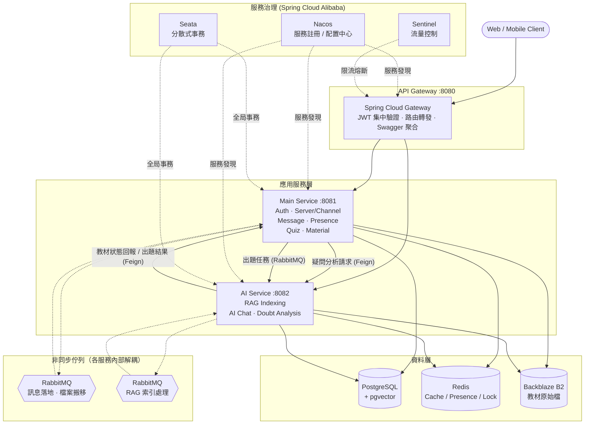
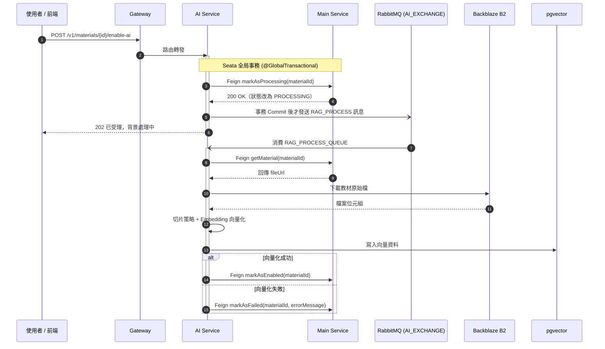
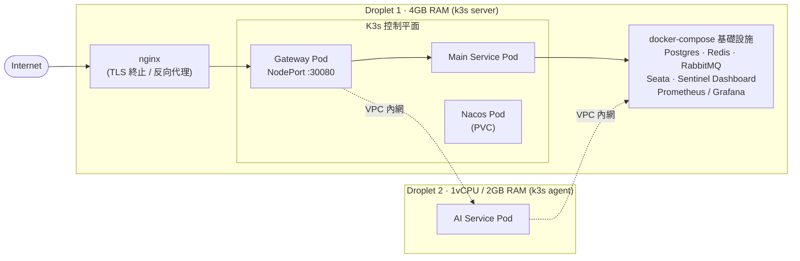

# Classcord — 技術架構文件

以「伺服器 ⭢ 頻道」為根基的 Discord 式即時社群互動，結合教材專屬 AI 助教（RAG）。
後端由 **Gateway + Main Service + AI Service** 三個 Spring Boot 微服務組成，由 Nacos / Sentinel / Seata 統一治理，PostgreSQL + pgvector 與 Redis 支撐資料層，RabbitMQ 負責跨服務與服務內的非同步解耦。

`Java 21` `Spring Boot 3.3` `Spring Cloud (Nacos, Gateway, OpenFeign, Sentinel, Seata)` `Spring AI` `Spring Security` `PostgreSQL + pgvector` `Redis 7` `RabbitMQ` `Docker → K3s` `GitHub Actions` `Backblaze B2` `Flyway`

> **文件狀態**：涵蓋整體架構、K3s 部署、三個服務的深入實作，以及 Redis / Seata / RabbitMQ 的橫切設計取捨。內容持續調整中。

---

## 專案功能概覽

教師建立班級伺服器，於其下的頻道發布教材、公告與討論；學生即時聊天、存取教材，並可針對每份教材專屬的 **AI 助教**提問。系統另外提供全班測驗正確率統計，以及由 AI 彙整的班級常見疑問分析，協助教師掌握教學成效。

後端三個服務之間的溝通方式、拆分的動機，以及實際遇到的工程取捨，是本文件接下來各章節的主題（各服務的職責細節見 [02 · 整體架構](#02--整體架構)）。各章節先說明該設計的目的與所解決的問題，再進入實作細節。

---

## 名詞定義

以下為文件中使用之關鍵技術名詞的簡要定義，供讀者參照：

| 名詞 | 定義 |
|---|---|
| **微服務** | 把一個大程式拆成好幾個各自獨立運作、獨立部署的小程式，彼此用網路溝通（相對於「單體」：所有功能寫在同一支程式裡） |
| **Gateway（網關）** | 系統對外的唯一入口，所有請求都先經過它，像大樓櫃檯，負責驗證身份、分流到對的內部服務 |
| **JWT** | 一種「電子通行證」，使用者登入後拿到一張，之後每個請求都出示這張證明「我是誰」，不用每次都重輸帳密 |
| **Nacos** | 服務註冊與配置中心，各服務在此登記自身位置，並互相查詢其他服務的位置，不需寫死彼此的網路位址 |
| **Sentinel** | 流量的守門員，設定「每秒最多幾個請求」，超過就先擋下來，避免瞬間爆量把系統打垮 |
| **Seata** | 讓「橫跨兩個不同服務、不同資料庫」的一系列操作，能像單一資料庫的交易一樣「要嘛全部成功、要嘛全部復原」 |
| **RabbitMQ（訊息佇列）** | 一個「代辦事項信箱」：A 服務把工作丟進信箱就能立刻去做別的事，B 服務有空再從信箱取件慢慢處理，兩邊不用互相等待 |
| **Redis** | 一個存在記憶體裡、讀寫極快的資料庫，常拿來做快取、計數器、暫存狀態，這份文件裡也拿它做限流與加鎖 |
| **pgvector / 向量資料庫 / RAG** | 把文字轉換成一串數字（向量）存起來，之後可以用「語意相不相近」而不是「文字有沒有完全match」來搜尋——這是 AI 助教能「讀懂教材再回答」的底層技術 |
| **K3s / Kubernetes（K8s）** | 容器編排系統，可自動化管理程式的部署與運行狀態：服務異常時自動重啟、需要擴充處理量時自動增開實例，取代人工逐台伺服器操作 |
| **分散式鎖** | 好幾個請求同時想做同一件事時（例如同時搶著初始化同一筆資料），用一個大家都看得到的「鎖」讓同一時間只有一個人能做，其他人等待或放棄 |
| **冪等** | 同一操作重複執行多次，結果與只執行一次相同，不會因重複呼叫而產生錯誤的疊加效果（例如「將狀態設為完成」重複執行不影響結果，但「餘額 +10」重複執行則會產生錯誤） |
| **Feign（OpenFeign）** | 讓「呼叫另一個服務的 API」這件事，寫起來就像呼叫自己程式裡的一般方法一樣簡單 |
| **WebSocket / STOMP** | 讓瀏覽器跟伺服器維持一條「雙向、即時」的連線，伺服器有新訊息可以主動推給使用者，不用使用者一直重新整理頁面 |
| **SSE** | 伺服器主動、持續推送更新給前端的一種輕量技術，這裡用來推播「出題進度跑到哪了」 |

---

## 目錄

- [00 · 亮點摘要](#00--亮點摘要)
- [01 · 技術棧](#01--技術棧)
- [02 · 整體架構](#02--整體架構)
- [03 · 拆分故事](#03--從單體到微服務的拆分故事)
- [04 · 核心流程](#04--核心流程教材啟用-ai-助教rag-向量化)
- [05 · 部署與維運：K3s](#05--部署與維運k3s)
- [06 · 服務深入：Gateway](#06--服務深入gateway)
- [07 · 服務深入：Main Service](#07--服務深入main-service)
- [08 · 服務深入：AI Service](#08--服務深入ai-service)
- [09 · Redis 使用邏輯](#09--redis-使用邏輯)
- [10 · Seata 分散式事務](#10--seata-分散式事務)
- [11 · RabbitMQ：非同步解耦與死信佇列設計](#11--rabbitmq非同步解耦與死信佇列設計)
- [12 · 資料庫索引設計](#12--資料庫索引設計)

---

## 00 · 亮點摘要

1. **從一支程式拆成三個服務** — 做 AI 助教功能之後發現，AI 運算（向量化、呼叫大語言模型）特別耗資源、也特別容易出狀況，跟其他功能綁在一起會互相拖累。於是把 AI 相關功能獨立成一個服務，它出問題時不會連累聊天、頻道這些核心功能。
2. **登入驗證只在大門做一次** — 使用者的「通行證」（JWT）只在 Gateway 這個大門驗證一次，驗證通過才會標記「這是誰」往裡面傳，並且會先清掉外部request可能夾帶的假冒標記，確保後面的服務收到的身份資訊絕對是真的，不用重複驗證。
3. **兩個服務、兩個資料庫也能「同進退」** — 教材啟用 AI 助教這個動作橫跨兩個服務、各自的資料庫，用 Seata 讓它們像操作同一個資料庫一樣，要嘛都成功、要嘛都復原，不會有「一邊做了、一邊沒做」的中間狀態。
4. **高併發控制：Redis 不只是拿來快取而已** — 用原子鎖、限流計數、引用計數等機制，處理「好幾個請求同時搶著做同一件事」的併發問題：例如同時有兩個人的網路都斷線又重連，要怎麼準確判斷這個人到底在不在線；或是同時兩個請求都想搶著做同一筆初始化。這些機制搭配 Java 21 虛擬執行緒與非同步佇列，是系統能承受同時大量請求的基礎。
5. **教材上傳到 AI 助教上線，是一條全自動的背景生產線** — 上傳、審核容量、內容切片、向量化、出題、疑問分析，這些比較花時間的工作全部丟到背景處理，使用者不用整個過程都在等待，並且能即時看到進度。
6. **索引設計跟著實際查詢方法走** — 資料庫的複合索引欄位順序，跟程式裡對應的查詢方法完全一致（先等值篩選、再排序），而不是套用預設值；向量搜尋與 JSON 欄位過濾也各自搭配了對應的索引類型。

---

## 01 · 技術棧

| 分類 | 內容 |
|---|---|
| **語言 / 框架** | Java 21（虛擬執行緒）、Spring Boot 3.3.5、Spring Security + JJWT、Spring AI 1.0.0-M6 |
| **服務治理** | Nacos（服務註冊 / 配置中心）、Sentinel（流量控制與熔斷）、Seata（分散式事務，Redis 儲存模式）、Spring Cloud Gateway、OpenFeign |
| **資料層** | PostgreSQL 16 + pgvector、Redis 7.2（快取／在線狀態／鎖／限流）、Flyway、Backblaze B2（教材物件儲存） |
| **非同步 / 即時通訊** | RabbitMQ（含死信佇列 DLX/DLQ）、WebSocket / STOMP、SSE（背景任務進度推播） |
| **維運 / 部署** | Docker Compose（本機開發）、K3s（正式環境，遷移中）、GitHub Actions CI/CD、Prometheus + Grafana |
| **AI / 第三方整合** | Gemini（Embedding / Chat / 出題）、pgvector VectorStore（RAG）、OAuth2（Discord / GitHub / Google）、Cloudflare Turnstile |

---

## 02 · 整體架構

系統由三個獨立部署的 Spring Boot 服務組成：**Gateway**（入口與身份驗證）、**Main Service**（社群互動與教學核心業務）、**AI Service**（AI 索引與推論）。三者之間需要即時回應的呼叫走 OpenFeign 同步溝通，不需要立即處理的工作則透過 RabbitMQ 非同步交派；整體由 Nacos（服務註冊與配置）、Sentinel（流量控制）、Seata（分散式事務）共同治理。



*圖 1 — 服務拓撲與資料流*

### Gateway :8080

所有請求進來的唯一入口。`JwtAuthGlobalFilter` 在最外層驗證使用者的「通行證」（JWT）簽章跟有沒有過期，通過後才把解出來的身份資訊（`userId` / `email`）標記在請求上往裡面傳——傳之前一定會先把請求原本可能夾帶的同名假冒標記清掉，避免有心人直接偽造身份跳過驗證。另外還負責流量守門（Sentinel）跟把三個服務各自的 API 文件（Swagger）聚合在同一個網址底下。

### Main Service :8081

平台的主體業務都在這裡：帳號與三方登入（Discord / GitHub / Google + JWT + 人機驗證）、班級伺服器與頻道管理、即時聊天訊息、教材上傳與容量管理，還有測驗出題、批改、班級學習狀況統計。

### AI Service :8082

專門負責最花運算資源的工作：把教材內容切片、轉成 AI 看得懂的「向量」格式存起來（這就是 RAG），提供針對該教材的 AI 問答，並透過 Gemini 大語言模型自動出題、分析全班學生常問的問題。

> **為什麼要同時用 Seata 跟 RabbitMQ，不是選一個就好？**
> 兩者解決的是不同層面的問題：跨服務狀態一致性屬於**正確性**問題，交由 Seata 處理；耗時但可延後執行的運算屬於**效能**問題，交由 RabbitMQ 移至背景處理。若將所有邏輯都納入 Seata 的事務範圍，向量化這類耗時操作也必須等待跨服務鎖釋放，會使系統回應變慢且更脆弱。

### 互動式 C4 Model

上面的服務拓撲圖是聚焦在資料流與治理機制的簡化版本；完整的 C4 Model（Context / Container 層級）另外用 IcePanel 維護，可以互動式展開查看：

<div style="overflow-x: auto; margin: 1.5rem 0; width: 100%;">
  <iframe src="https://s.icepanel.io/IVhqLydKcwcztz/L4xt" height="800" title="Hyslab Tech's organization - Hyslab Tech's landscape" style="border-radius: 16px; border: none; width: 100%; min-width: 320px; max-width: 1200px; display: block; margin: 0 auto;"></iframe>
</div>

---

## 03 · 從單體到微服務的拆分故事

專案最初是一支程式包辦所有功能，把「即時社群互動 ＋ AI 學習」的想法逐步做出來。隨著 AI 助教功能加進去，問題浮現：AI 運算（向量化、呼叫大語言模型）比其他功能耗資源多太多，如果繼續跟主要業務邏輯綁在同一支程式裡，兩者耦合太深；而且一旦 AI 那部分掛掉，會直接拖垮整個網站其他原本好好的功能（聊天、頻道全部一起壞掉）。這讓「把 AI 獨立出來」變成必要的決定。

拆分的過程要處理幾件事：

- **重新界定服務邊界** — 把原本混在同一支程式裡的 AI 相關功能整理出來，明確劃分「誰負責哪些資料、哪些職責」。
- **服務間溝通改用 OpenFeign** — 原本是同一支程式裡「呼叫一個方法」，現在變成「透過網路呼叫另一個服務」，中間多了逾時、失敗要怎麼處理等新問題要設計。
- **抽出共用模組** — 決定哪些共用的資料格式、設定、錯誤處理該放進三個服務都能用的共用套件，哪些該留在各自服務裡。
- **重寫部署與 CI/CD** — 啟動方式、網路設定都要因應「從一支程式變三支」整個重寫；建置流程也從「編譯一次」變成「三個服務各自有自己的建置流程」。

拆分後，AI 服務可以獨立擴充規模、獨立部署：未來如果 AI 運算需求暴增，只要針對這一個服務加開機器就好，不用連帶影響其他核心功能；服務之間的故障也被隔開了，AI 服務即使出狀況，也不會波及聊天、頻道這些日常使用最頻繁的基礎功能。

---

## 04 · 核心流程：教材啟用 AI 助教（RAG 向量化）

使用者觸發「啟用 AI 助教」後，系統的處理流程如下：

1. 請求先到 Gateway，轉給 AI Service。
2. AI Service 先跟 Main Service 說：「這份教材我要開始處理了，幫我把狀態標成『處理中』」。**這一步跟接下來要不要真的成功處理，被綁在同一個「要嘛一起成功、要嘛一起復原」的保證裡**（Seata）——萬一標記完之後緊接著發生別的錯誤，這個標記也會一起被撤銷，不會卡在一個不上不下的狀態。
3. 標記成功後，AI Service 把「開始處理這份教材」的工作丟進背景信箱（RabbitMQ），然後立刻回覆使用者「已受理，背景處理中」，使用者不用乾等。
4. 背景另外有一個工人隨時在看信箱，拿到工作後去下載教材原始檔、把內容切片、轉成向量存進資料庫。
5. 處理完成（或失敗），再回頭通知 Main Service 把教材狀態改成「已啟用」或「處理失敗」。



*圖 2 — 教材向量化時序圖*

上面步驟 2 到 3 之間有一個容易被忽略、但很重要的細節，對應的程式碼如下：

```java
@GlobalTransactional(name = "enable-ai-assistant", rollbackFor = Exception.class)
public void enableAiAssistant(UUID materialId) {
    materialClient.markAsProcessing(materialId);   // Feign 呼叫 Main Service

    if (RootContext.inGlobalTransaction()) {
        // 註冊一個「事務確定 Commit 後才執行」的回呼，而不是立刻發送
        TransactionHookManager.registerHook(new TransactionHookAdapter() {
            @Override
            public void afterCommit() {
                rabbitTemplate.convertAndSend(
                    RabbitMQConfig.AI_EXCHANGE,
                    RabbitMQConfig.ROUTING_KEY_RAG_PROCESS,
                    materialId.toString());
            }
        });
    }
}
```

程式碼會先判斷目前是不是處於 Seata 的全局事務中，如果是，就註冊一個「等這個事務真的確定 Commit 後才執行」的回呼，才把工作丟進背景佇列，而不是標記完狀態就立刻發送訊息。這是為了避免「佇列裡已經有一個工作準備要處理，但 Main Service 那邊的狀態其實還沒真正確定寫進資料庫（甚至隨後可能被回滾）」這種資料不一致的情況。

---

## 05 · 部署與維運：K3s

正式環境需要具備自我修復能力：服務異常時自動重啟，流量增加時自動擴充實例。這是容器編排系統 Kubernetes（此專案採用其輕量版 **K3s**）的核心功能：部署方式、健康檢查、異常時的重啟策略都定義為宣告式設定檔，交由系統自動執行，取代原本需要人工介入的操作。

正式環境跑在兩台雲端主機（DigitalOcean Droplet）上，採**混合部署**：**比較少變動的基礎設施**（資料庫、Redis、訊息佇列等）繼續用原本熟悉的 Docker Compose 手動管理就好，不需要動用到 K8s 這麼重的工具；**自己寫的三個服務（Gateway、Main Service、AI Service）交給 K3s** 管理，換取前面說的「自動重開、方便擴充」的好處。這條路目前還在 `feat/k3s` 分支上進行中。

### 叢集拓撲

- **主機 1（4GB RAM）**：K3s 的「控制中心」+ Nacos + Gateway + Main Service，同時也跑著上面提到的所有 Docker Compose 基礎設施。
- **主機 2（1 vCPU / 2GB RAM）**：K3s 的「工作機」，只跑 AI Service —— 刻意讓運算量最大、最容易把 CPU 吃滿的服務獨佔一台機器，不去跟 Gateway / Main Service 搶資源。
- 兩台機器之間走雲端內網互通（不是走公開網際網路），因為每台機器其實有兩張網卡（一張對外、一張內網），設定時要特別指定用內網那張，不然機器之間會連不通。
- K3s 內建的 Traefik 與 ServiceLB 被停用，因為主機上已經有獨立部署的 **nginx** 負責對外流量與 HTTPS 終止，避免兩者搶用同一個埠號。



*圖 3 — 兩台主機的混合部署拓撲*

### nginx：對外的 TLS 終止與反向代理

K3s 只負責叢集內部的服務編排，對外的 HTTPS 終止與網域轉發交給主機上獨立部署的 nginx 處理，設定檔（`nginx/classcord`）裡有幾個跟這個系統的特性直接相關的設定：

```nginx
location / {
    proxy_pass http://127.0.0.1:30080;   # 轉發至 Gateway 的 K3s NodePort
    proxy_http_version 1.1;

    # WebSocket 雙向通信升級標頭
    proxy_set_header Upgrade $http_upgrade;
    proxy_set_header Connection $http_connection;

    # 轉發真實使用者 IP，供 Gateway / Sentinel 依 IP 限流使用
    proxy_set_header X-Real-IP $remote_addr;
    proxy_set_header X-Forwarded-For $proxy_add_x_forwarded_for;

    # 停用代理緩衝，支援 AI 助教的串流輸出（SSE / Chunked）
    proxy_buffering off;

    # 延長逾時時間，支援 WebSocket 與 AI 長連線
    proxy_read_timeout 86400s;
    proxy_send_timeout 86400s;
}
```

三個設定各自對應到前面章節提到的功能：`proxy_buffering off` 是因為 [08 · AI Service](#08--服務深入ai-service) 的串流問答若被 nginx 預設的緩衝機制整批攔截，會失去「逐字輸出」的效果；`X-Forwarded-For` 的轉發是 [06 · Gateway](#06--服務深入gateway) 依 IP 限流能取得真實用戶端位址的前提；`proxy_read_timeout` 拉長到 24 小時則是為了讓 WebSocket 連線不會被反向代理提前掐斷。nginx 另外也負責簽發憑證、安全標頭（HSTS、X-Frame-Options 等），以及把監控看板 Grafana 掛在獨立的子網域上。

### 排程與資源調校，都是從實際觀測數據回推的

以 Gateway 的部署設定為例：

```yaml
spec:
  strategy:
    type: Recreate           # 先關舊的、再開新的
  template:
    spec:
      nodeSelector:
        workload: main        # 釘在主機 1
      containers:
        - name: gateway
          resources:
            requests: { memory: "256Mi", cpu: "100m" }
            limits:   { memory: "384Mi", cpu: "500m" }
          livenessProbe:
            httpGet: { path: /actuator/health, port: 8080 }
            initialDelaySeconds: 90   # 對齊應用程式實際開機所需時間
```

- 明確指定「這個服務只能開在哪一台機器上」：Gateway、Main Service、Nacos 開在主機 1（跟原本 Docker Compose 的佈局一致），AI Service 開在主機 2。Nacos 因為資料存在本機硬碟上，一旦飄到別台機器就會連不到舊資料，更是非釘死不可。
- 更新版本時選擇「先關掉舊的、再開新的」，而不是「新舊並存、慢慢切換」：因為主機 1 記憶體本來就吃緊，新舊兩份程式同時存在會直接把記憶體塞爆，所以選擇容忍幾秒鐘的短暫斷線，換取不超出記憶體上限。
- 每個服務可以用多少記憶體、多少 CPU，都不是隨手填的數字，而是照實際觀測到的流量與程式本身的記憶體設定回推出來的——例如某個服務的上限值，是照它過去在正常流量下實際逼近的舊上限抓出留一點餘裕的新數字。
- 健康檢查「多久之後才開始檢查」的秒數，特意對齊程式本身開機需要的時間，避免程式其實還在啟動中，就被系統誤判成「已經掛了」而強制重啟，陷入「一直重啟、永遠啟動不完」的迴圈。
- 有一個第三方監控元件（Sentinel Dashboard）的位址，透過比較底層的 JVM 啟動參數傳進去，而不是用比較常見的 Spring 設定方式——因為這個元件讀取位址設定的時機，比 Spring 框架本身準備好還要早，用 Spring 的方式會讀不到值。

### CI/CD：Tag 觸發、映像檔打版號、逐一等待部署完成

自動部署的流程只在推送一個正式版本標籤（或手動觸發）時才會執行：

1. **建置階段**：同時建置三個服務的映像檔，推到 GitHub 的容器倉庫，同時打上「最新版」與「這次的版本號」兩個標記。
2. **部署階段**：把設定檔傳到主機 1，透過遠端連線：
   - 先確保基礎設施是最新的（這步幾乎不會有變化，但每次都跑一遍當作保險，不會影響已經在跑的容器）。
   - 套用所有 K3s 的設定檔。
   - 把三個服務明確換成**這次發布的版本號**，而不是依賴「最新版」這個標籤——避免因為映像檔快取或多台機器抓取的時間點不同，導致「明明是同一次部署，結果各機器跑到不同版本」的情況。
   - 一個一個確認每個服務真的部署成功，任何一個失敗這次部署就算失敗，不會出現「畫面顯示成功，但服務其實沒真的起來」的假象。

```bash
kubectl apply -f k8s/
kubectl set image deployment/gateway gateway=ghcr.io/hysyoi/classcord-gateway:${IMAGE_TAG} -n classcord
kubectl rollout status deployment/gateway -n classcord --timeout=180s
```
3. **通知階段**：不論成功或失敗都發訊息通知，讓人知道這次是哪個版本、誰觸發的。

### 節點建置腳本：把「手動指令」變成「可重複執行的文件」

新增或重建一台機器要跑的建置步驟，寫成一支腳本存起來，不會被自動部署流程執行，只有真的要新增/重建機器時手動跑。目的是把原本散落在操作記錄裡、只有自己記得的一次性指令，整理成一份任何人都能照著做的說明書，分成三種情境：初始化主機、加入新的工作機、或是幫已經在叢集裡的機器補上遺漏的標籤。

---

## 06 · 服務深入：Gateway

Gateway 是整個系統唯一對外開放的入口，負責**驗證請求身份、依路徑分流至對應服務、並控制流量**。除此之外，它也將三個服務各自的 API 文件整合為單一入口，方便查閱。

### 路由設計：不是一條規則打到底

系統裡有好幾條不同的路由規則，而不是圖方便寫一條規則轉發所有流量，原因是**每一類請求的風險程度不一樣，需要各自的流量管制策略**：

| 這類請求 | 對應路徑 | 轉去哪個服務 | 為什麼要獨立出來 |
|---|---|---|---|
| 登入註冊 | `/v1/auth/**` | Main Service | 獨立出來才能單獨設定「防止有人寫程式狂刷登入」的流量限制，不跟一般 API 混在一起 |
| 即時聊天連線 | `/ws/**` | Main Service | 這類連線要優先被辨識出來，確保不會被後面的規則搶先攔截 |
| AI 相關功能 | `/v1/materials/*/enable-ai` 等少數幾個端點 | AI Service | 只挑出真正會觸發 AI 運算的端點，而不是整個都導去 AI Service，讓流量限制精準打在最貴的操作上 |
| 其他一般業務 | `/v1/**` | Main Service | 剩下所有請求的預設路由 |
| API 文件 | `/v3/api-docs/{service}` | 對應服務 | 把各服務原本各自的文件網址，統一改寫成同一種格式，藏在這層做整合 |

實際的路由設定如下，轉發目的地寫的是服務的「名字」（`lb://classcord-xxx-service`）而不是寫死的機器位址，實際位址交給 Nacos 動態查詢：

```yaml
routes:
  - id: auth-route
    uri: lb://classcord-main-service
    order: -1
    predicates:
      - Path=/v1/auth/**

  - id: ai-service-route
    uri: lb://classcord-ai-service
    order: 1
    predicates:
      - Path=/v1/materials/*/enable-ai, /v1/materials/chat-sessions/**, /api/v1/ai/**

  - id: main-service-route
    uri: lb://classcord-main-service
    order: 2
    predicates:
      - Path=/v1/**
```

服務之後要多開幾份實例處理更多流量時，Gateway 這邊完全不用改任何設定。

### 集中驗證身份：通行證只驗一次，假冒的一律清除

驗證身份的檢查點設在所有業務邏輯之前跑：先放行不需要登入的頁面（例如登入頁本身），其餘請求就檢查通行證（JWT）的簽章跟有沒有過期，驗證通過才把解出來的身份資訊標記到請求上往下傳——**標記之前一定先把請求原本可能夾帶的同名假冒標記清掉**，避免外部使用者直接偽造身份、跳過驗證去騙後面的服務。後面的服務因此可以直接信任這個標記，不需要再重複驗證一次通行證，省下每個請求都要重新驗證簽章的開銷。

### 流量管制：不同路由不同上限，被擋下時給明確的理由

流量控制設在 Gateway 這一層（而不是各服務自己內部做），因為擋在最外層可以在請求真正打進任何後端服務之前就先攔下來，省下白費的內部呼叫。三種主要路由各自有不同的預設流量上限：

- **登入相關**：上限稍微嚴格一點，因為登入端點需要比較謹慎地防護暴力嘗試，但仍然留了足夠寬鬆的空間，不會誤傷正常的登入尖峰。
- **AI 相關**：上限刻意壓得最低，因為背後接的是呼叫大語言模型與向量化，是全站成本最高、最容易被打爆的資源。
- **一般業務**：上限最寬鬆，防的是大規模惡意流量攻擊，而不是正常使用者的行為。

這些數字寫在程式裡的只是「服務剛啟動、還沒連上設定中心時」的預設值；正式環境會由 Nacos 上的設定動態覆蓋，代表流量上限不需要重新部署程式就能調整。被擋下來時也不是回一個千篇一律的錯誤，而是依照被攔在哪一種路由，回傳「AI 服務忙碌中」「登入請求較多」等看得懂的訊息，前端可以依照不同情況做不同的提示。

### 其他細節

- **瀏覽器跨網域請求的快取**：瀏覽器每次呼叫 API 前，會先發一個「詢問許可」的請求，這裡設定讓瀏覽器把許可結果快取一小時，避免每次呼叫都要多問一次。
- **API 文件整合**：把 Main Service 與 AI Service 各自的 API 文件掛在同一個網址底下，對外只需要記一個網址就能查所有服務的 API。

---

## 07 · 服務深入：Main Service

Main Service 是平台的業務主體，涵蓋帳號、社群互動、教材與測驗六大模組。以下依模組整理實作上比較值得一提的設計，Redis 相關的細節統一收錄在 [09 · Redis 使用邏輯](#09--redis-使用邏輯)，這裡只點出「用在哪裡、為什麼這樣設計」。

### Auth（帳號）：三方登入用「策略模式」，帳號合併有資安把關

登入除了帳密之外，還支援 Discord / GitHub / Google 三種第三方登入。程式沒有寫一長串「如果是 Discord 就怎樣、如果是 GitHub 就怎樣」的判斷，而是定義一個共通介面：

```java
public interface OAuth2Strategy {
    AuthProvider getProvider();
    OAuthUserInfoDto verifyAndExtractInfo(String token);
}
```

`DiscordAuthStrategy` / `GithubAuthStrategy` / `GoogleAuthStrategy` 各自實作這個介面，程式啟動時 Spring 會自動把所有實作蒐集進一個 `Map<AuthProvider, OAuth2Strategy>`。之後要新增一個登入平台，只要多寫一個實作類別，完全不用修改既有的判斷邏輯。

兩個值得注意的細節：

- **向第三方平台驗證這段比較慢的網路呼叫，刻意不佔用資料庫連線**：只有真正確定要寫入使用者資料時，才開一個很短的資料庫操作，避免呼叫外部服務的等待時間，把資料庫連線也一起卡住。
- **帳號合併有資安把關**：如果第三方平台回傳的信箱，剛好跟本地既有帳號的信箱一樣，但這個平台**沒有驗證過**這個信箱真的是本人的，一律拒絕自動合併——否則有心人能用一個沒驗證信箱的假冒身份，去接管別人原本的帳號。

搭配的還有依 IP 位址限制登入嘗試次數（避免被寫程式狂刷）、人機驗證，以及登出時讓通行證立刻失效（不用等它自然過期）。

### Server / Channel（伺服器與頻道）：角色 × 頻道類型的權限矩陣

班級成員分「老師」「助教」「學生」三種角色，頻道分一般文字頻道、只有老師助教能看能寫的管理頻道、以及只有老師助教能發布、學生只能看的教材頻道。這組權限判斷不是隨便寫在前面擋一下「有沒有登入」就算了，而是在每個實際寫入的動作前，依角色跟頻道類型的組合仔細判斷，例如學生想在教材頻道發言會被直接拒絕。

### Message（訊息）：即時聊天跟「真正存進資料庫」是分開的兩件事

聊天走的是能雙向即時通訊的連線方式（WebSocket）。建立連線的當下就會驗證通行證，通過後把身份綁定在這條連線上，之後同一條連線的所有訊息都能直接拿到「這是誰傳的」，不需要每則訊息都重新出示通行證一次。

收到聊天訊息後，系統會**用查出來的頻道實際所屬的伺服器 ID，去覆蓋前端請求裡帶的伺服器 ID**，兩者對不起來就直接拒絕廣播——這是為了防止有人偽造伺服器 ID，把訊息硬廣播進自己根本沒加入的班級頻道。

真正把訊息寫進資料庫這件事則是非同步進行的：

```java
UUID messageId = UuidCreator.getTimeOrderedEpoch(); // 產生 UUIDv7
Instant now = Instant.now();

rabbitTemplate.convertAndSend(
    RabbitMQConfig.MESSAGE_EXCHANGE,
    RabbitMQConfig.ROUTING_KEY_MESSAGE_SAVE,
    new MessageSaveTask(messageId, userId, channelId, request.content(), now));

Message message = Message.builder().channel(channel).user(user)
        .content(request.content()).build();
message.setId(messageId);        // 尚未寫入資料庫，先用預先生成的 ID 回傳／廣播
message.setCreatedAt(now);
return message;
```

系統會先生成一組 **UUIDv7**（帶有時間順序特性的 UUID）作為訊息編號，直接把這個「還沒真正寫進資料庫」的訊息物件回傳／廣播出去，實際寫入資料庫的工作則封裝成一則任務丟進背景佇列，由另一個消費者非同步完成。使用者感受到的訊息延遲因此只取決於廣播的速度，不需要等待一次資料庫寫入的往返時間；由於 UUIDv7 本身帶有時間順序，即使寫入時間有先後落差，之後依 ID 查詢排序時依然完全正確。

### Presence（在線狀態）：不做一份「全站共用」的在線名單

多分頁、多裝置同時開著，只有在「所有連線都斷開」時才真正判定為離線；每個使用者的在線狀態各自獨立紀錄，不共用一份全站名單。這樣設計是為了避免「只要系統裡還有任何一個人在線，就會連帶讓某個早該離線、卻沒有正常觸發斷線通知的人，繼續被誤判成在線」的問題。實作細節見 [09 · Redis 使用邏輯](#09--redis-使用邏輯)。

### Material（教材）：上傳容量管理與檔案儲存

教材檔案存在雲端物件儲存服務（Backblaze B2）上，流程分兩段：前端先跟 Main Service 要一個**限時的上傳授權網址**，系統會先檢查班級權限、每小時上傳次數上限、全站已用容量後才發放，前端直接把檔案傳到雲端儲存、不經過應用程式伺服器中轉；上傳完成後前端再呼叫確認端點，系統驗證這份上傳授權合法之後，才正式寫入資料庫、更新容量統計，並丟一則背景訊息通知後續的搬移／清理作業。

這裡的「全站已用容量」平常直接讀 Redis 裡的一個計數器（避免每次上傳都對資料庫做一次昂貴的加總查詢），但這個計數器第一次被用到時（例如 Redis 剛重啟、資料被清空過）並不存在，需要花一次成本較高的資料庫查詢把它初始化出來——這個初始化過程用了 [09 · Redis 使用邏輯](#09--redis-使用邏輯) 提到的 Redisson 進階鎖，避免同時有兩個上傳請求同時觸發初始化、重複做兩次昂貴查詢。

其中「把教材標記成處理中」這個動作，用的是資料庫層級明確的鎖定寫法：

```java
// 使用原生 SQL 明確指定 FOR UPDATE，避免 Hibernate 6.x 自動生成 FOR NO KEY UPDATE
// 導致 Seata 內建的 SQL Parser 無法解析
@Query(value = "SELECT * FROM materials WHERE id = :id FOR UPDATE", nativeQuery = true)
Optional<Material> findByIdForUpdate(@Param("id") UUID id);
```

框架原本可以用註解自動產生鎖定語法，但在 Hibernate 6.x 搭配 PostgreSQL 的組合下，框架自動產生出來的語法會跟 Seata 用來解析 SQL、寫回滾紀錄的內建工具不相容，導致跨服務的共同交易直接失敗。改用明確指定 `FOR UPDATE` 的原生 SQL 繞開這個相容性問題，同時這道鎖也順便防止同一份教材被同時觸發兩次 AI 處理。資料庫連線字串另外設定了 `lock_timeout=2000ms`，確保這類鎖定查詢在 2 秒內拿不到鎖就直接失敗回報錯誤，而不是無限期卡住等待。

### Quiz（測驗）：背景出題 + 即時進度推播

出題是比較花時間的 AI 操作，因此設計成背景工作：建立一個「出題任務」後立即回應前端一個任務編號，實際出題丟給背景處理（由 AI Service 消費並呼叫 Gemini），期間前端持續訂閱這個任務的即時進度。幾個處理得比較細的地方：

- **失敗狀態一定寫得進去**：更新任務狀態的動作被設計成一個獨立的資料庫操作，即使呼叫端所在的主要流程稍後失敗或卡住，任務的「失敗」狀態與錯誤原因依然能被獨立寫入並推播出去，不會讓使用者永遠看不到失敗原因。
- **支援斷線重連**：前端重新整理頁面重新訂閱時，後端會先查一次任務目前的實際狀態——如果已經完成或失敗，直接補送最終結果並結束連線，不讓前端傻等；如果還在進行中，也會先補送一次目前的進度快照，避免重連後畫面空白。
- **班級疑問焦點分析**：用分散式鎖加上快取，防止同時有兩個人重複觸發昂貴的分析，並限制同一份教材一天只能重新分析一次，避免有人狂點「重新生成」浪費 AI 額度——鎖的實作細節同樣收錄在 [09 · Redis 使用邏輯](#09--redis-使用邏輯)。

---

## 08 · 服務深入：AI Service

AI Service 完全不碰任何「業務規則」——誰有沒有權限看班級分析報告、快取要留多久、要不要限流，這些判斷都留在 Main Service 那一層決定；AI Service 只專心做一件事：**把教材變成 AI 看得懂的格式、把這個格式變成有用的回答**。這條界線劃得很清楚：Main Service 做完權限檢查、快取、加鎖之後，才會跨服務呼叫 AI Service 去真正跑 AI 分析，AI Service 完全不需要知道「誰能看這份報告」這種業務層面的問題。

### RAG 索引：把教材變成「AI 看得懂的格式」

處理流程設計成可以替換的策略，方便未來針對不同教材類型調整做法。目前的做法是：

1. 用現成的文件解析工具讀懂常見的教材格式（PDF、Word、Markdown 等）。
2. 把長文字依一定的長度切成一段一段（切片之間刻意留一點重疊），避免語意剛好被切在關鍵句子中間、變得支離破碎。
3. 在存進向量資料庫之前，**先幫每個切片標記好它屬於哪個班級、哪個頻道、哪份教材**——這是為了將來「同一個資料庫要同時服務所有班級、所有教材」預先鋪好的過濾依據，讓之後回答問題時能精準只搜自己這份教材的內容，不會搜到別班的東西。

### 自訂 Embedding 模型：把第三方 API 包成框架看得懂的樣子

當時使用的 AI 框架版本還沒有現成支援這裡選用的 AI 供應商（Gemini）的向量化功能，所以自己動手把對方的官方 API 包裝成框架期待的標準介面：

- **批次化**：對方的 API 單次最多接受 100 筆文字，於是把整批要處理的內容依 100 筆一組分批送出，把「N 段文字等於 N 次網路呼叫」降為「N/100 次」，大幅減少網路往返次數。
- **限流保護**：呼叫前一律先檢查當天的額度用完了沒（目前設定為全站每日對話上限 400 次、向量化上限 3000 筆，皆可透過設定檔調整，細節見 [09 · Redis 使用邏輯](#09--redis-使用邏輯)），避免單一教材的向量化任務把當天的 API 額度一次燒光，導致其他人都不能用。

### AI 助教問答：檢索 + 對話歷史 + 一個字一個字吐出回答

問答功能會先根據**使用者當下這一句提問**去資料庫裡找出最相關的教材內容片段（而不是把整段對話歷史都拿去搜尋，這樣搜尋結果會比較精準），再把找到的片段連同最近幾則歷史訊息一起交給 AI 模型，讓它產生有憑有據、又能接續上下文的回答。

回答支援「一個字一個字即時吐出來」的串流體驗，這裡有一個容易被忽略、但重要的細節：**內容一邊即時吐給使用者看、一邊在背景偷偷把完整內容緩衝起來，等全部吐完之後，才把完整的這則回覆存回資料庫**——而且這個存檔動作特地丟到另一個獨立的執行緒去做，不佔用正在忙著即時吐字的少量執行緒，避免拖慢其他使用者當下正在進行的串流回應。

### 背景出題：把工作拆開來平行處理，同時管控整體用量

背景收到出題任務後的處理邏輯：

```java
List<String> contexts = slicingStrategy.slice(chunks, count);  // 依題數平均分段

try (var executor = Executors.newVirtualThreadPerTaskExecutor()) {
    List<CompletableFuture<GeneratedQuestionDto>> futures = contexts.stream()
        .map(context -> CompletableFuture.supplyAsync(() -> {
            acquireGeminiRateLimitPermit(jobId);      // 取得全站共用的呼叫許可
            return generateSingleQuestion(context, difficulty);
        }, executor))
        .toList();

    dtos = futures.stream().map(CompletableFuture::join).toList();
}
quizClient.completeJob(jobId, new SaveGeneratedQuestionsRequest(jobId, materialId, dtos));
```

1. 先把該教材的所有內容片段，依照要出的題數平均分段，確保每一題的出題來源都覆蓋教材的不同段落，而不是每題都從同一小段內容重複出題。
2. 對每一段內容都用 Java 21 的虛擬執行緒（Virtual Thread）同時（平行）呼叫一次 AI 模型生成一道題目，而不是一題一題排隊生成，大幅縮短一次出多題所需要的總時間。
3. 每次呼叫前都要先拿到一張「全站共用」的許可證才能真的打 API——這張許可證的額度存在 Redis（每 60 秒最多 900 次），而不是存在單一台機器的記憶體裡，拿不到就等 1 秒後重試、最多重試 10 次。好處是即使 AI Service 之後真的擴充成好幾台機器一起跑，這道全站流量閘門依然有效，不會因為多開了幾台機器就變相把對第三方 API 的呼叫上限乘了好幾倍。
4. 全部題目生成完成後，把結果傳回 Main Service 落庫並標記任務完成；任何一步出錯，都會改成標記任務失敗，讓前端能收到明確的失敗狀態，而不是永遠卡在「處理中」。

### 教材下載的重試設計：跟「檔案搬移」的一場資格賽

背景工人要下載教材原始檔時，用的是「失敗就等一下重試，最多重試幾次」的簡單機制。原因是：教材上傳完成後，Main Service 那邊會另外觸發一個「把檔案搬到正式目錄」的背景工作，這個搬移工作跟「啟用 AI 助教」這個工作彼此獨立、沒有互相等待對方完成的機制，理論上有機率「AI 這邊先跑到，但正式檔案其實還沒搬移完成」。簡單的重試機制給了搬移工作一點緩衝時間，用最簡單的方式解決了這個時間差問題，而不用另外花力氣設計更複雜的跨工作同步機制。

---

## 09 · Redis 使用邏輯

Redis 在這個專案裡身兼五種角色：**快取**、**在線狀態**、**分散式鎖**、**限流／配額計數**、**登出通行證黑名單**。共用模組裡放了 6 支 Lua 小程式（可以直接在 Redis 裡面執行的簡單腳本），設計理念都一樣：把「先讀取判斷、再寫入」這種本來要好幾個指令才能完成、中間有機會被別的請求插隊搗亂的操作，包成一個**單一、不可分割**的動作。

這類問題屬於典型的競態條件（race condition）：若「檢查」與「寫入」是兩個分開的步驟，兩個並行的請求可能同時通過檢查、再同時寫入，導致結果超出預期範圍——例如兩台提款機同時查詢同一帳戶餘額皆顯示足夠，於是同時放行扣款，造成超額提領。解法是將「檢查」與「寫入」合併為單一、不可分割的操作，Redis 的 Lua 腳本即用於實現這一點。

### 六支小程式，各自解決一種併發問題

| 用途 | 解決的問題 |
|---|---|
| **限流計數** | 每個請求進來就計數一次，只有在「這是這個時段第一次計數」或「計時器意外消失」時才重新設定倒數時間，避免每次請求都重設倒數導致限流永遠不會真正生效 |
| **安全加減量** | 只有在這個計數器「已經存在」時才做加減，計數器不存在就什麼都不做，避免不小心把一個從沒初始化過的計數器變成負數，或憑空生出一個不該存在的計數器 |
| **安全解鎖** | 解鎖前先確認「這把鎖真的是我上的」才刪除——避免「我搶的鎖因為處理太久而自動過期、被別人搶走之後，我才姍姍來遲執行解鎖，結果把別人的鎖給刪了」這種常見的分散式鎖錯誤 |
| **上線/離線計數** | 把「連線數加一或減一」跟「歸零後刪除／續期」包成一步，避免這兩個動作中間被一個緊接著到來的新連線插隊 |

以限流計數與安全解鎖這兩支腳本的實際內容為例：

```lua
-- rate_limit.lua：KEYS[1] = 計數器 key，ARGV[1] = 過期秒數，ARGV[2] = 本次要增加的量
local delta = tonumber(ARGV[2]) or 1
local count = redis.call('incrby', KEYS[1], delta)
-- 只有「這是第一次計數」或「計時器意外消失」時才重設過期時間
if count == delta or redis.call('ttl', KEYS[1]) == -1 then
    redis.call('expire', KEYS[1], tonumber(ARGV[1]))
end
return count
```

```lua
-- unlock.lua：KEYS[1] = 鎖的 key，ARGV[1] = 呼叫端自己持有的鎖 Token
if redis.call('get', KEYS[1]) == ARGV[1] then
    return redis.call('del', KEYS[1])
else
    return 0   -- 不是自己的鎖，不執行刪除
end
```

一個值得注意的設計是：**`rate_limit.lua` 這一支腳本被四種完全不同的情境共用**——限制單一 IP 對登入端點的嘗試次數、限制每帳號每小時的上傳次數、限制全站每日 AI 使用額度、限制對第三方 AI API 的呼叫頻率。差異只在於「計數器叫什麼名字、倒數多久、上限是多少」，核心的「原子計數 + 有條件重設倒數」邏輯完全共用，不需要為每種限流情境各寫一份。

### 在線狀態：每個使用者獨立的 TTL 紀錄

判斷「這個人在不在線」的做法是：每個使用者對應一把專屬的 Redis key（`presence:conn:{userId}`），是否在線只看這把 key 存不存在，並各自設定過期時間（TTL）。

```lua
-- presence_connect.lua：KEYS[1] = 該使用者的連線數計數器 key，ARGV[1] = TTL 秒數
local count = redis.call('incr', KEYS[1])
redis.call('expire', KEYS[1], ARGV[1])
return count
```

```java
Long count = redisTemplate.execute(presenceConnectScript,
        List.of(connKey), String.valueOf(TTL.getSeconds()));
if (count != null && count == 1) {
    // 連線數從 0 變 1，才視為真正上線並廣播
    applicationEventPublisher.publishEvent(new PresenceEvent(userId, true));
}
```

伺服器會定時查詢「目前確實還連著」的使用者名單（來源是 WebSocket 連線框架本身即時維護的連線註冊表，準確反映實際連線狀態），只幫這份名單裡的人延長 TTL，避免使用者明明還在線、TTL 卻先到期而被誤判離線。

這個設計要處理的核心問題是：使用者不一定會正常觸發斷線事件——網路直接中斷、瀏覽器當機，都不會讓伺服器收到「這個人斷線了」的通知。因為每個人的 key 與 TTL 都是獨立的，這種情況下沒有人會再幫這個使用者的 key 續期，TTL 到期後這把 key 就會自動消失，正確反映「這個人已經不在線」，不需要額外的清理邏輯，也不會受到系統裡其他仍在線使用者的狀態影響。

其他幾個實作細節：

- **多分頁/多裝置**：同一使用者開多個分頁會建立多條連線，因此在線狀態用「還剩幾條連線」而非單純的「有/沒有」來追蹤，連線數從 0 變 1 才真正廣播「上線了」、歸零才廣播「離線了」。
- **服務重啟時清空殘留狀態**：Main Service 目前只運行單一份實例（尚未水平擴充為多份同時運行），因此服務重啟必然代表所有舊連線都已斷開，啟動時可以安全地找出所有殘留紀錄並清空。這個假設是有前提的：若日後 Main Service 擴充為多份實例同時運行，重啟其中一份不代表其他份上的連線也已斷開，屆時這段清空邏輯就需要調整。清空時用的是對整體效能友善的漸進式查詢方式，而不是一次把所有資料掃過一遍造成瞬間卡頓。
- **打包指令減少網路往返**：定時為在線使用者延長效期、以及批次查詢一批使用者是否在線，都把多筆指令打包成一次送出，避免使用者一多，光是網路來回就浪費大量時間。

### 兩種分散式鎖策略並存，是刻意的取捨而非不一致

專案裡同時存在兩種「搶鎖」的做法，而不是統一成一種：

- **輕量、一次性的鎖**（用在班級疑問分析）：

  ```java
  String lockValue = UUID.randomUUID().toString();
  Boolean acquired = redisTemplate.opsForValue()
          .setIfAbsent(lockKey, lockValue, 5, TimeUnit.MINUTES);
  if (Boolean.TRUE.equals(acquired)) {
      try {
          // 搶到鎖之後再檢查一次快取，避免重複計算
          String cached = redisTemplate.opsForValue().get(cacheKey);
          if (cached == null) {
              // ...呼叫 AI Service 進行分析、寫入快取...
          }
      } finally {
          redisTemplate.execute(unlockScript, List.of(lockKey), lockValue);
      }
  }
  ```

  搶鎖跟解鎖都用最基本的做法實作（`SETNX` + 上面的 `unlock.lua`），搭配**搶到鎖之後再檢查一次快取**：先確認前一個搶到鎖的請求是不是已經把結果算好、寫進快取了，如果已經算好就直接用，不用自己重算一次，避免同時有兩個請求重複跑一次昂貴的 AI 分析。這種鎖夠用、夠輕量，適合「持有時間短、不常發生衝突、搶不到大不了排隊重試」的場景。

- **自動延長效期的進階鎖**（Redisson）：用在 [07 · Main Service](#07--服務深入main-service) 的 Material 模組提到的「全站已用容量計數器」第一次初始化時——這個計數器平常直接讀 Redis，但計數器不存在時（例如 Redis 剛重啟過）需要對資料庫做一次加總查詢才能算出正確的初始值：

  ```java
  private void initSystemQuotaCounterIfAbsent() {
      if (Boolean.FALSE.equals(redisTemplate.hasKey("QUOTA:SYSTEM:USED"))) {
          RLock lock = redissonClient.getLock("LOCK:SYSTEM:QUOTA");
          if (lock.tryLock(3, TimeUnit.SECONDS)) {
              try {
                  // 進鎖後再次確認，避免自己是第二個搶到鎖、前面已經有人做完了
                  if (Boolean.FALSE.equals(redisTemplate.hasKey("QUOTA:SYSTEM:USED"))) {
                      long usedSystem = materialRepository.sumAllFileSizes();  // 昂貴的加總查詢
                      redisTemplate.opsForValue().set("QUOTA:SYSTEM:USED", String.valueOf(usedSystem));
                  }
              } finally {
                  lock.unlock();
              }
          }
      }
  }
  ```

  這段程式碼會在每次有人要上傳教材、檢查容量配額時被呼叫到，只有計數器真的不存在時才會真正做事。用 Redisson 鎖的好處是鎖被持有期間會自動幫忙延長效期（Watchdog 機制），不用擔心「初始化邏輯剛好卡住比預期久，鎖卻先失效被別人搶走」的邊界情況。

兩者沒有統一成同一套，是因為兩個場景「鎖會被持有多久」跟「萬一出錯代價多大」不一樣：初始化只會發生在服務剛啟動、資料剛好被清空的瞬間，用重一點的工具換取更高的容錯空間比較划算；疑問分析則是平常就可能高頻發生的一般操作，用最輕量的方式實作就夠了，不需要為它引入更重的機制。

### 登出黑名單：讓「登出」在通行證到期前立即生效

JWT 通行證本身沒有「狀態」的概念——只要簽章驗證通過，在它原本設定的效期內永遠有效，這跟「使用者登出後這張通行證應該立刻失效」是互相矛盾的。解法是：登出時把這張通行證記錄進一份「黑名單」（設定的有效期跟通行證剩餘的效期一致，過期後不需要手動清理），之後每次請求（包含一般網頁請求跟建立即時連線）都先查一次這份黑名單裡有沒有這張通行證，有的話就視為未登入。

---

## 10 · Seata 分散式事務

先講一下「分散式事務」到底在解決什麼問題：假設兩個不同的部門，各自管著自己的一本帳本，某件事需要**兩本帳本同時更新**才算完成——如果只有一本更新成功、另一本失敗了，就會出現「事情做到一半、兩邊對不起來」的爛攤子。如果是同一本帳本，資料庫本身的「交易」機制就能保證要嘛全部成功要嘛全部復原；但兩本不同的帳本（不同服務、不同資料庫）要怎麼也做到這種保證，就是 Seata 要解決的問題。

專案的基礎設施（部署腳本、設定中心）都完整佈好了 Seata，但程式碼裡目前只有**一個地方**真正用到這種「跨服務同進退」的保證：教材啟用 AI 助教的流程（見 [04 · 核心流程](#04--核心流程教材啟用-ai-助教rag-向量化)）。只在這一個地方用，是刻意的決定，不是漏做。

### 為什麼恰好是這裡需要，其他地方不需要

這個流程的特殊之處在於：這是系統中少數「一個邏輯操作，必須橫跨兩個服務、各自獨立的資料庫，維持狀態一致」的場景——AI Service 請 Main Service 把教材標記成「處理中」，這筆寫入發生在 Main Service 自己的資料庫；如果這之後 AI Service 這邊的流程又失敗了，Main Service 那筆已經寫入的狀態如果沒有一起被復原，教材就會永遠卡在「處理中」，卻沒有任何背景工作真的在處理它。Seata 讓這種跨服務、跨資料庫的復原可以自動發生，不需要另外手寫一套「萬一失敗了要怎麼手動改回來」的補救邏輯。

系統裡其他跨服務的互動，之所以不需要 Seata，是因為它們大多屬於下面兩種情況，靠現有機制就足夠應付：

- **本來就只發生在單一服務內部**，資料庫本身的交易機制就能保證正確性，沒有跨資料庫的問題。
- **刻意設計為最終一致性（eventual consistency）**：出題結果、教材處理成功／失敗的狀態回報，都是透過**冪等的狀態更新**（例如「將狀態設為完成」）搭配背景訊息完成，即使中途失敗，重新觸發一次也不會產生錯誤的疊加結果，因此不需要動用兩階段提交等級的一致性保證。

### 這也是一個關於「取捨」的真實案例

Seata 並非沒有代價：它需要額外的伺服器、需要一個地方存放復原用的紀錄，也曾在 [07 · Main Service](#07--服務深入main-service) 提到的資料庫鎖定語法相容性問題上實際造成過事務失敗，需要額外排查才能繞開。這個專案的做法是：只在唯一真正需要「跨服務同進退」的地方使用 Seata，而不是每一次跨服務呼叫都預設套用這層保證——**分散式事務應用於真正需要跨服務原子性的場景，而非預設機制。**

---

## 11 · RabbitMQ：非同步解耦與死信佇列設計

RabbitMQ 在此扮演生產者與消費者之間的緩衝角色：呼叫方（生產者）將工作寫入訊息佇列後即可繼續處理下一個請求，不需等待該工作實際完成；處理方（消費者）依自身處理能力，逐一取出佇列中的訊息執行。兩者透過佇列解耦，各自依照自己的步調運作，互不阻塞。

專案裡宣告了四組獨立的佇列：教材搬移與刪除、AI 教材處理、測驗背景出題、訊息非同步落庫。每一組都各自綁定一個死信佇列（DLQ，處理失敗訊息的收集區）：

```java
@Bean
public Queue ragProcessQueue() {
    return QueueBuilder.durable(RAG_PROCESS_QUEUE)
            .deadLetterExchange(MATERIAL_DLX)
            .deadLetterRoutingKey(ROUTING_KEY_RAG_DLK)
            .build();
}
```

失敗的訊息依然照原本的業務類別分開收集，方便之後針對特定類別的失敗訊息重新處理或排查原因。

### 兩種截然不同的「為什麼要非同步」

專案裡用 RabbitMQ 解決的其實是兩種不同性質的問題：

- **跨服務整合解耦**（AI 教材處理、測驗出題）：Main Service 觸發一個交給 AI Service 執行的昂貴工作（向量化、呼叫 AI 模型），AI Service 非同步消費、處理完再回報結果。這裡的重點是**故障隔離**——AI Service 處理得慢或暫時掛掉，都不會影響 Main Service 呼叫端的回應速度。
- **服務內部的體感延遲解耦**（訊息落庫、教材搬移）：呼叫端根本不需要等這件事真的做完就能回應使用者。這個模式常常跟「先幫結果生一個看起來已經完成的樣子」搭配出現——例如 [07 · Main Service](#07--服務深入main-service) 提到的聊天訊息會先生成好編號再回應，讓使用者感受到的延遲只取決於廣播速度，不必等一次資料庫寫入的往返時間。

### 重試策略：先讓系統自己救，救不了才送進失敗收集區

系統設定了自動重試：

```yaml
rabbitmq:
  listener:
    simple:
      retry:
        enabled: true
        max-attempts: 3          # 最多重試 3 次
        initial-interval: 1000ms # 第一次重試等 1 秒
        multiplier: 2.0          # 每次重試加倍等待 (1s -> 2s -> 4s)
        max-interval: 5000ms     # 最長等待 5 秒
```

大部分暫時性的小狀況（網路抖動、下游服務短暫沒回應）靠這組「越等越久」的重試就能自己恢復，完全不用額外寫重試的程式碼。

但**不是所有錯誤都值得重試**：

```java
try {
    storageService.moveFile(event.sourceKey(), event.targetKey());
} catch (NoSuchKeyException e) {
    // 來源檔案不存在，重試也不會有結果，直接跳過剩餘重試、送進 DLQ
    throw new AmqpRejectAndDontRequeueException("源檔案不存在，拒絕重試", e);
} catch (Exception e) {
    throw e;   // 其餘暫時性錯誤，交給預設的自動重試機制處理
}
```

處理檔案搬移工作時，如果發現「來源檔案根本不存在」，程式會讓這則訊息直接跳過剩下的重試次數、立刻送進死信佇列——因為這種錯誤不管重試幾次結果都一樣，繼續重試只是白白浪費三次等待的時間，不如直接讓它進死信佇列等人工排查。其餘暫時性的錯誤（例如搬移過程中網路突然中斷）則直接把例外往外拋，交給預設的自動重試機制處理。

### 訊息格式：用通用的 JSON，而不是綁死 Java 專屬格式

所有訊息都以 JSON 格式在佇列裡傳遞。因為丟訊息的一方（例如 Main Service）跟收訊息的一方（AI Service）是兩支完全獨立、各自部署升版的程式，如果用 Java 語言專屬的序列化格式，會讓兩邊被迫綁死在同一個版本上；改用大家都看得懂的 JSON，只要兩邊約定好的資料格式相容，就不會因為兩邊各自升版的時間差而互相出錯。

---

## 12 · 資料庫索引設計

資料庫 schema 定義在 Main Service 的 Flyway migration（`V1__init.sql`）中。索引不是套用框架預設值，而是跟著程式裡實際的查詢方法一起設計的。

### 複合索引跟隨查詢的存取模式

多數清單型查詢的模式都是「依某個外鍵篩選、再依時間排序」，例如查詢某個 AI 對話會話的歷史訊息：

```java
List<AiMessage> findBySessionIdOrderByCreatedAtDesc(UUID sessionId, Limit limit);
```

```sql
CREATE INDEX idx_ai_messages_session_created
    ON ai_messages USING btree (session_id, created_at DESC);
```

索引的欄位順序完全對應查詢的存取順序：先用 `session_id` 做等值篩選，鎖定範圍後，`created_at DESC` 讓資料庫可以直接依索引順序取出結果，不需要另外排序。這是索引設計裡的**最左前綴原則**——複合索引 `(a, b)` 只有從最左邊的欄位 `a` 開始篩選才會生效，若查詢條件跳過 `a` 直接用 `b`，這個索引就派不上用場。同樣的對應關係還出現在：

| 查詢方法 | 對應的複合索引 |
|---|---|
| `findByUserIdAndMaterialIdOrderByCreatedAtDesc(userId, materialId)` | `idx_ai_sessions_user_material (user_id, material_id, created_at DESC)` |
| `findByChannelId(channelId, pageable)`（依建立時間排序分頁） | `idx_messages_channel_created_at (channel_id, created_at DESC)` |

### RAG 檢索的關鍵：HNSW 向量索引

```sql
CREATE INDEX idx_material_chunks_embedding
    ON material_chunks USING hnsw (embedding vector_cosine_ops);
```

[08 · AI Service](#08--服務深入ai-service) 提到的「依語意相似度搜尋教材片段」，如果沒有這個索引，資料庫必須把每一筆向量都拿出來計算一次餘弦距離，資料量一大就會退化成全表掃描。HNSW 是 pgvector 提供的近似最近鄰（ANN）索引，讓相似度搜尋不需要跟全部資料逐一比對，也是這個系統能支撐 RAG 檢索的關鍵。

### 多租戶過濾的關鍵：JSONB 上的 GIN 索引

```sql
CREATE INDEX idx_material_chunks_metadata
    ON material_chunks USING gin (metadata);
```

同樣在 [08 · AI Service](#08--服務深入ai-service) 提到，每個教材切片的 Metadata 裡標記了 `server_id` / `channel_id` / `material_id`，讓問答時能「只搜自己這份教材的內容」。這個過濾條件實際上是在查詢 JSONB 欄位裡的鍵值，GIN 索引正是 PostgreSQL 針對這類「內容包含查詢」設計的索引類型，讓這個過濾動作不需要逐筆解析 JSONB 內容。

### 唯一鍵對應真實的業務規則

幾個唯一約束不是隨手加上去的，各自對應一條業務規則：`uq_server_user (server_id, user_id)` 確保一個使用者不能重複加入同一個班級伺服器；`uq_provider_uid (provider, provider_uid)` 確保同一個第三方帳號不會被綁定兩次，是 [07 · Main Service](#07--服務深入main-service) 提到的 OAuth 身份識別能正確運作的前提；`uq_users_email` 則是信箱作為登入帳號必須唯一的基本要求。

---

Classcord Backend · 技術架構文件
本文件涵蓋：整體架構、K3s 部署、Gateway / Main Service / AI Service 服務深入、Redis 使用邏輯、Seata / RabbitMQ 設計取捨、資料庫索引設計。
